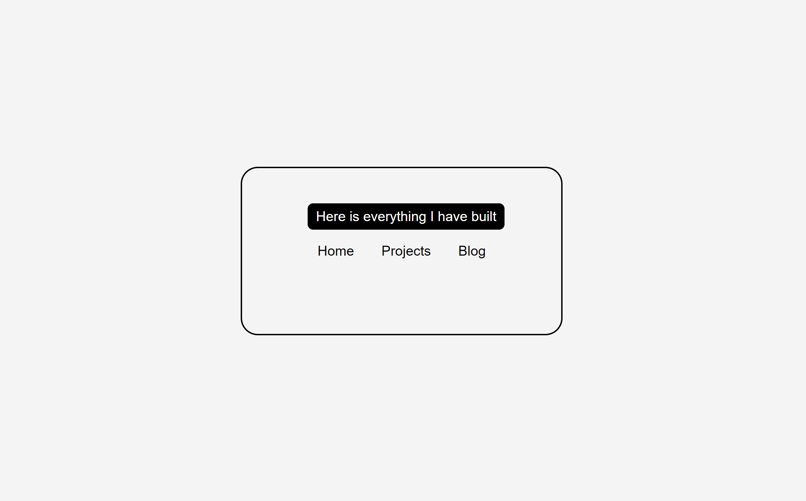

# Tooltip UI - Navigation Tooltip Project

## Description

The **Tooltip UI** project focuses on creating interactive tooltips for navigation links using only HTML and CSS, without any JavaScript. This project aims to help developers understand key CSS concepts like positioning, hover effects, and transitions. When a user hovers over a navigation item, a tooltip appears to provide additional context for the item.

This project is part of the [Roadmap.sh Tooltip UI Project](https://roadmap.sh/projects/tooltip-ui) and serves as an excellent opportunity to master dynamic UI effects with CSS.

### Features

- **Tooltips on Hover**: Displays additional information about a navigation item when hovered.
- **Smooth Transitions**: Provides a sleek user experience with CSS-based animations.
- **CSS-Only Implementation**: No JavaScript required.
- **Easy to Customize**: Simple HTML attributes and CSS allow for easy modifications to tooltips.
- **Cross-browser Compatibility**: Works on most modern browsers.
  
### Alternatives

While many tooltip implementations use JavaScript for added interactivity, this project offers a lightweight, CSS-only approach that prioritizes performance and simplicity.

## Visuals

Here’s what the final project looks like:



## Installation

To use this project, follow these steps:

1. Clone the repository:
   ```bash
   git clone https://github.com/Yashi-Singh-9/Tooltip-UI.git
   ```
2. Navigate into the project directory:
   ```bash
   cd Tooltip-UI
   ```
3. Open the `index.html` file in your preferred web browser:
   ```bash
   open index.html
   ```
   
No additional installation is required, as the project is purely HTML and CSS.

### Requirements

- No special dependencies are required. The project works on all modern browsers without the need for a build system or JavaScript.

## Support

If you encounter any issues or have questions, you can reach out via:

- Opening an issue in the [Github repository](https://github.com/Yashi-Singh-9/Tooltip-UI/issues).
- LinkedIn: [Yashi Singh](https://www.linkedin.com/in/yashi-singh-b4143a246)

## Roadmap

Planned future improvements for the project:

- **Responsive Design Enhancements**: Improve tooltip positioning and size on mobile devices.
- **Customizable Themes**: Allow easy theme-switching for different tooltip styles.
- **More Complex Tooltips**: Experiment with different tooltip shapes, animations, and interactions.

## Contributing

Contributions are welcome! To contribute:

1. Fork the repository.
2. Create a new branch (`git checkout -b feature/new-feature`).
3. Commit your changes (`git commit -am 'Add new feature'`).
4. Push the branch (`git push origin feature/new-feature`).
5. Create a pull request.

Please make sure your code follows the current style and includes tests where applicable.

### Running Tests

Before submitting a pull request, make sure to:

1. Validate your HTML and CSS.
2. Check compatibility across different browsers and screen sizes.
3. Run any existing tests if applicable.

## Authors and Acknowledgments

This project was developed by [Yashi Singh](https://www.linkedin.com/in/yashi-singh-b4143a246).  
Special thanks to [Roadmap.sh](https://roadmap.sh/) for providing the project guidelines and inspiration.

## License

This project is licensed under the MIT License - see the [LICENSE](LICENSE) file for details.
